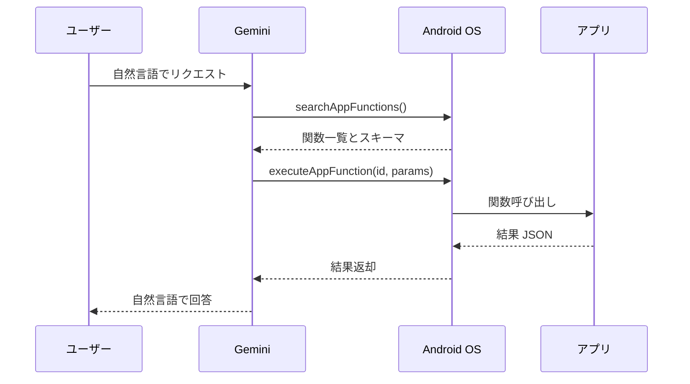

[AppFunctions の概要  \|  AI  \|  Android Developers](https://developer.android.com/ai/appfunctions?hl=ja)

### 記事2: App Functionsによるアプリの将来

**URL:** https://blog.shreyaspatil.dev/the-future-of-android-apps-with-appfunctions

#### 概要
ユーザーが AI エージェントに「Zomato で最後に注文したものを繰り返して」と頼む時代が来ると、Deep Link や SEO では不十分になる。Android AppFunctions はアプリの中核機能を OS・AI エージェントに公開するための仕組みで、KDoc アノテーションで関数の説明・引数・戻り値を自己記述することで Gemini 等が自然言語から発見・実行できるようになる。バックエンドの MCP に相当するオンデバイス版と位置づけられており、Android 16 と Jetpack ライブラリで利用可能。呼び出し権限はシステムアプリに限定されており、ADB コマンドでテストできる。

#### AppFunctions の呼び出しフロー

#### ポイント

| 項目 | 内容 |
|---|---|
| 概念 | KDoc アノテーションで関数・引数・戻り値を自己記述し、Gemini等が自然言語で発見・実行できるようにする |
| 依存関係 | `androidx.appfunctions:appfunctions-service/appfunctions/appfunctions-compiler:1.0.0-alpha08` + KSP |
| ADB テスト | `adb shell cmd app_function list-app-functions` / `execute-app-function` でテスト可能 |
| セキュリティ | 呼び出しは `EXECUTE_APP_FUNCTIONS` 権限を持つシステムアプリのみ（Gemini/OEMアプリ等） |
| 対応デバイス | 現状 Samsung S26 Ultra と Google Pixel 10 のみ |

---

